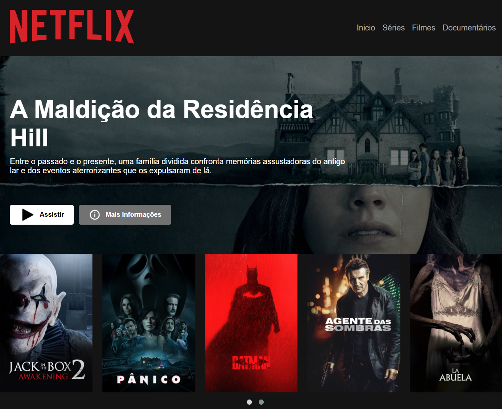

# Olá! 👋 Meu nome é **Joel Silva** e esse é um projeto feito através do **Bootcamp Carrefour** da **DIO**.
### O projeto consiste em um clone da interface da **Netflix**.
 

 

Foi bem divertido de se fazer, por em prática conhecimentos sobre **HTML5/CSS3/Javascript**, principalmente para conhecer mais sobre os plugins do **JQuery** e o uso do **Carrossel**, descobrir como eles funcionam e o quão facil podem ser para coloca-los em funcionamento.

**O resultado pode ser visto logo abaixo também:**

Ou entrando pelo link também para melhor visualização: 

<a target="_blank" href="https://joeljsilva.github.io/netflix-dio/">https://joeljsilva.github.io/netflix-dio/</a>
